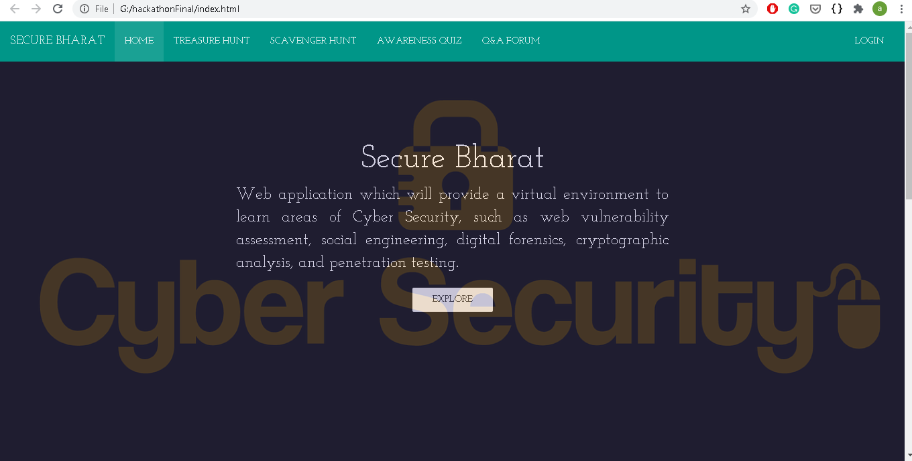

# SECURE_BHARAT
Secure Bharat is a responsive website presented at Smart India Hackathon 2017. It aimed at providing Awareness about Cyber Security to everybody in India.
It is build considering in mind all kind of people from novice to professional. It is platform to learn and practice the analogy of hacking and get acquited with some skills like Wireshark, phishing attacks, atm frauds etc.

## Smart India Hackathon Details
Team Name - Hindustan Squad
Title of the idea - Secure Bharat
i4c id - 7169

#### Name of members
1. Dixit Kumar
2. Arpit Maheshwari
3. Nidhi Bothra
4. Piyush Sharma
5. Shubham Sharma
6. Ayush Sharma

College Name - M. B. M. Engineering College, Jodhpur, Rajasthan 

Selected in final round of SmartIndiaHackathon-2K17

### Tech Stack
1. Database 
* PHP 5.6 
* MYSQLi

2. WEB TECHNOLOGIES 
* HTML5
* CSS3 
* BOOTSTRAP
* AJAX
* JAVASCRIPT

### We proposed Secure Bharat will contain four ways of learning Computer Security.
1. Quiz - Learn by quizzing 
2. Treasure Hunt - Learn by doing challeges
3. Scavenger Hunt - Learn by reading and finding 
4. QnA Forum - Ask, get answers and learn 

### Some screenshots from project
#### Main Page

#### Login Page

#### Quiz Page

#### Treasure Hunt page

#### Scavenger Hunt page

### Conclusion :
It was a good proposal and liked by the judges as well. But this approach lacks in implementation due to limitations of cyber security tools available.
As it is a cyber security related project, it needs to be handled with care and knowledge expert needs to take this idea and develop it further. Also, suggested that cyber security training and certificates can also be provided to profesionals in website. So, it can become a potential one stop solution for cyber security awareness and learning in India.    
